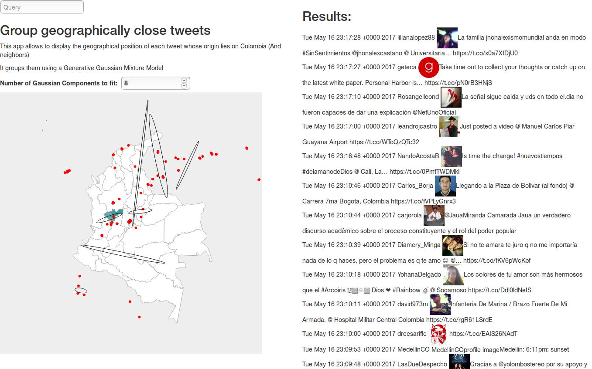

# tweeter-geostreamer
Live map that displays each tweet in a map according to its geographical origin.

## Deployment
To deploy this project, you must have Meteor installed, you must create and define your own Twitter API keys. After completing this steps, you can define a bash/batch script that executes the following instructions:

### *NIX

```bash
#!/usr/bin/env bash

export TWITTER_CONSUMER_KEY="your_consumer_key"
export TWITTER_CONSUMER_SECRET="your_consumer_secret"
export TWITTER_ACCESS_TOKEN_KEY="your_access_token_key"
export TWITTER_ACCESS_TOKEN_SECRET="your_access_token_secret"

meteor npm install
meteor
```

### Windows
```batch
set TWITTER_CONSUMER_KEY="your_consumer_key"
set TWITTER_CONSUMER_SECRET="your_consumer_secret"
set TWITTER_ACCESS_TOKEN_KEY="your_access_token_key"
set TWITTER_ACCESS_TOKEN_SECRET="your_access_token_secret"

meteor npm install
meteor
```

## Sample screenshot

